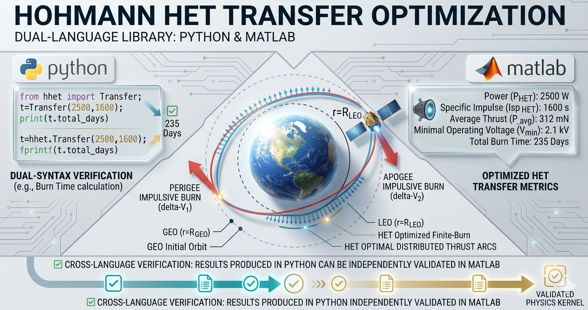

### 🚀 Hohmann Transfer with Hall Effect Thrusters (HohmannHET)

[](https://opensource.org/licenses/Apache-2.0)
[](https://github.com/ATaylorAerospace/HohmannHET)
[](https://github.com/ATaylorAerospace/HohmannHET)
[](https://ataylor.getform.com/5w8wz)

## 📋 Overview

**HohmannHET** is a library for low-thrust orbital transfers combining Keplerian Hohmann mechanics, high-fidelity Hall Effect Thruster (HET) propulsion models, and mission optimization solvers.

The library delivers identical numerical results across **Python**, **C++20**, and **MATLAB** to within a floating-point tolerance of `1e-6`, making it suitable for cross-environment verification, flight-software prototyping, and academic research.

**Author:** A Taylor | **Reference:** Vallado / Curtis

---

## ✨ Key Features

### 🎯 **Tri-Language Core Parity**
- Identical `dynamics`, `propulsion`, and `optimization` modules in Python, C++, and MATLAB
- Cross-language delta-V and TOF agreement to `1e-6` (km/s / s)
- Shared physical constants: `mu = 398600.4418 km^3/s^2`, `R_E = 6378.137 km`

### 🔧 **Three Physics Modules**
- **dynamics**: Keplerian Hohmann logic, impulsive maneuvers, circular velocity, orbital period
- **propulsion**: High-fidelity HET models: anode efficiency, beam voltage, exhaust velocity, Tsiolkovsky mass budget
- **optimization**: Golden-section solver for minimum-propellant / minimum-TOF mission design

### 🧮 **Mathematical Transparency**
- Every physics equation documented in LaTeX (Python docstrings / C++ Doxygen / MATLAB help blocks)
- References: Vallado "Fundamentals of Astrodynamics and Applications," Curtis "Orbital Mechanics for Engineering Students," Goebel & Katz "Fundamentals of Electric Propulsion"

### 🧪 **Comprehensive Testing**
- **Python:** `pytest` suite with `astropy.units` quantity checks
- **MATLAB:** `matlab.unittest` class-based tests with `arguments` validation
- **C++:** GoogleTest (gtest/gmock) with parameterized scenarios
- All suites validate against LEO-to-GEO benchmark values (Vallado Table 6-1)

---

## 🏗️ Repository Structure

```
HohmannHET/
├── python/
│   ├── pyproject.toml              # Hatch build config, astropy dependency
│   ├── src/
│   │   └── hohmann_het/
│   │       ├── __init__.py
│   │       ├── dynamics.py         # Hohmann transfer, circular velocity, TOF
│   │       ├── propulsion.py       # HET operating point, Tsiolkovsky equation
│   │       └── optimization.py     # Golden-section Isp optimizer
│   └── tests/
│       ├── test_dynamics.py
│       ├── test_propulsion.py
│       └── test_optimization.py
│
├── matlab/
│   ├── +hohmann_het/
│   │   ├── Dynamics.m              # Static-method class with arguments blocks
│   │   ├── Propulsion.m
│   │   └── Optimization.m
│   └── tests/
│       ├── TestDynamics.m          # matlab.unittest TestCase
│       ├── TestPropulsion.m
│       └── TestOptimization.m
│
└── cpp/
    ├── CMakeLists.txt              # C++20, header-only library + GTest suite
    ├── include/
    │   └── hohmann_het/
    │       ├── dynamics.hpp        # Doxygen-annotated header-only implementation
    │       ├── propulsion.hpp
    │       └── optimization.hpp
    └── tests/
        ├── CMakeLists.txt
        ├── test_dynamics.cpp
        ├── test_propulsion.cpp
        └── test_optimization.cpp
```

---

## 🛠️ Technical Specifications

### **Physical Constants**
| Parameter | Value | Unit |
|-----------|-------|------|
| Earth's Gravitational Parameter (mu) | 398,600.4418 | km^3/s^2 |
| Earth's Equatorial Radius | 6,378.137 | km |
| Standard Gravity (g0) | 9.80665 | m/s^2 |
| Xenon Atom Mass | 2.180174e-25 | kg |
| Cross-language Precision | 1e-6 | - |

### **Supported Transfer Scenarios**
- ✅ Low Earth Orbit (LEO) to Geostationary Orbit (GEO)
- ✅ Reverse transfers (GEO to LEO)
- ✅ Custom altitude transfers
- ✅ Same-altitude validation (zero delta-V)
- ✅ Extreme altitude differences (up to 100,000 km)
- ✅ HET propellant budget via Tsiolkovsky rocket equation
- ✅ Isp optimization: minimum-propellant / minimum-burn-time trade-off

---

## 🚀 Quick Start

### Python

**Install (development mode):**

```bash
cd python
pip install -e ".[dev]"
```

**Run the test suite:**

```bash
pytest tests/ -v
```

**Usage example:**

```python
import astropy.units as u
from hohmann_het import compute_hohmann, compute_het_state, optimize_isp

# Hohmann transfer: LEO 400 km -> GEO 35786 km
transfer = compute_hohmann(400.0 * u.km, 35786.0 * u.km)
print(f"Total dv  : {transfer.total_dv:.4f}")
print(f"TOF       : {transfer.tof_hours:.3f}")

# HET operating point (SPT-100 class)
het = compute_het_state(300.0, 1350.0, 0.50)
print(f"Isp       : {het.isp:.1f}")
print(f"Thrust    : {het.thrust:.4f}")

# Optimize Isp for 1000 kg spacecraft, 5 kW thruster
result = optimize_isp(1000.0 * u.kg, transfer.total_dv, 5000.0 * u.W, 0.55)
print(f"Optimal Isp : {result.optimal_isp:.1f}")
print(f"Propellant  : {result.propellant_mass:.2f}")
```

---

### MATLAB

Add the `matlab/` directory to your MATLAB path, then call:

```matlab
addpath(genpath('matlab'))

% Hohmann transfer
result = hohmann_het.Dynamics.compute_hohmann(400, 35786);
fprintf('Total dv = %.4f km/s\n', result.total_dv);
fprintf('TOF      = %.3f h\n',    result.tof_hours);

% HET operating point
state = hohmann_het.Propulsion.compute_het_state(300, 1350, 0.50);
fprintf('Isp      = %.1f s\n', state.isp);

% Optimize Isp
opt = hohmann_het.Optimization.min_propellant_transfer(400, 35786, 1000, 5000, 0.55);
fprintf('Opt Isp  = %.1f s\n', opt.optimal_isp);
```

**Run MATLAB tests:**

```matlab
cd matlab/tests
results = runtests({'TestDynamics','TestPropulsion','TestOptimization'});
table(results)
```

---

### C++ (CMake)

**Requirements:** CMake >= 3.20, C++20-capable compiler, internet access (GoogleTest fetched automatically).

**Build:**

```bash
cd cpp
cmake -B build -DCMAKE_BUILD_TYPE=Release
cmake --build build
```

**Run tests:**

```bash
cd build
ctest --output-on-failure
```

Or run individual test binaries:

```bash
./build/tests/test_dynamics
./build/tests/test_propulsion
./build/tests/test_optimization
```

**Use as a CMake dependency:**

```cmake
# In your CMakeLists.txt
add_subdirectory(path/to/hohmann_het/cpp)
target_link_libraries(my_target PRIVATE hohmann_het)
```

**Usage example:**

```cpp
#include "hohmann_het/dynamics.hpp"
#include "hohmann_het/propulsion.hpp"
#include "hohmann_het/optimization.hpp"

using namespace hohmann_het;

auto transfer = compute_hohmann(400.0, 35786.0);
auto het      = compute_het_state(300.0, 1350.0, 0.50);
auto opt      = optimize_isp(1000.0, transfer.total_dv() * 1000.0, 5000.0, 0.55);
```

---

## 📊 LEO-to-GEO Benchmark

Reference values (Vallado Table 6-1), verified across all three languages:

| Quantity | Value | Unit |
|----------|-------|------|
| Departure burn (dv1) | ~2.40 | km/s |
| Arrival burn (dv2) | ~1.46 | km/s |
| Total delta-V | ~3.86 | km/s |
| Transfer time | ~5.29 | hours |

---

## 📋 Citations

```bibtex
@misc{ATaylor_HohmannHET_2026,
  author = {A. Taylor},
  title  = {HohmannHET: Low-Thrust Orbital Transfer Library},
  year   = {2026},
  url    = {https://github.com/ATaylorAerospace/HohmannHET}
}
```

---

## 📬 Contact

[](https://ataylor.getform.com/5w8wz)
